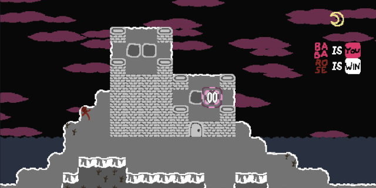

## Baba is the Night
This is a custom level pack for [Baba is You](https://hempuli.com/baba/).

**Content warning:** vampires, blood, fire, death

Includes:

* 64 puffs, 3 blossoms, 4 bonuses
* Custom music tracks
* Scripts for visual effects and sounds

See [REFERENCES](REFERENCES.md) for a partial list of assets and references (with minor spoilers).

### Installing

- Download the latest release from this repository: [link](https://github.com/someusername6/baba-is-the-night/archive/master.zip)
- Extract in its own directory to `[...]/Baba Is You/Data/Worlds/`.

Alternatively, [clone the repository](https://docs.github.com/en/github/creating-cloning-and-archiving-repositories/cloning-a-repository)
and pull new updates when necessary.

Custom levels and level editor must be enabled.

### Changelog
- 1.0.1
  - Change skulls into ghosts in levels where defeat is triggered by overlap rather than proximity.
  - Recolor some inactive text sprites for better visibility.
  - Add missing path to rose on Chantry level.
  - Add extra hidden rules to (secret location) to avoid unwinnable save state.
- 1.0.0
  - Initial release.
